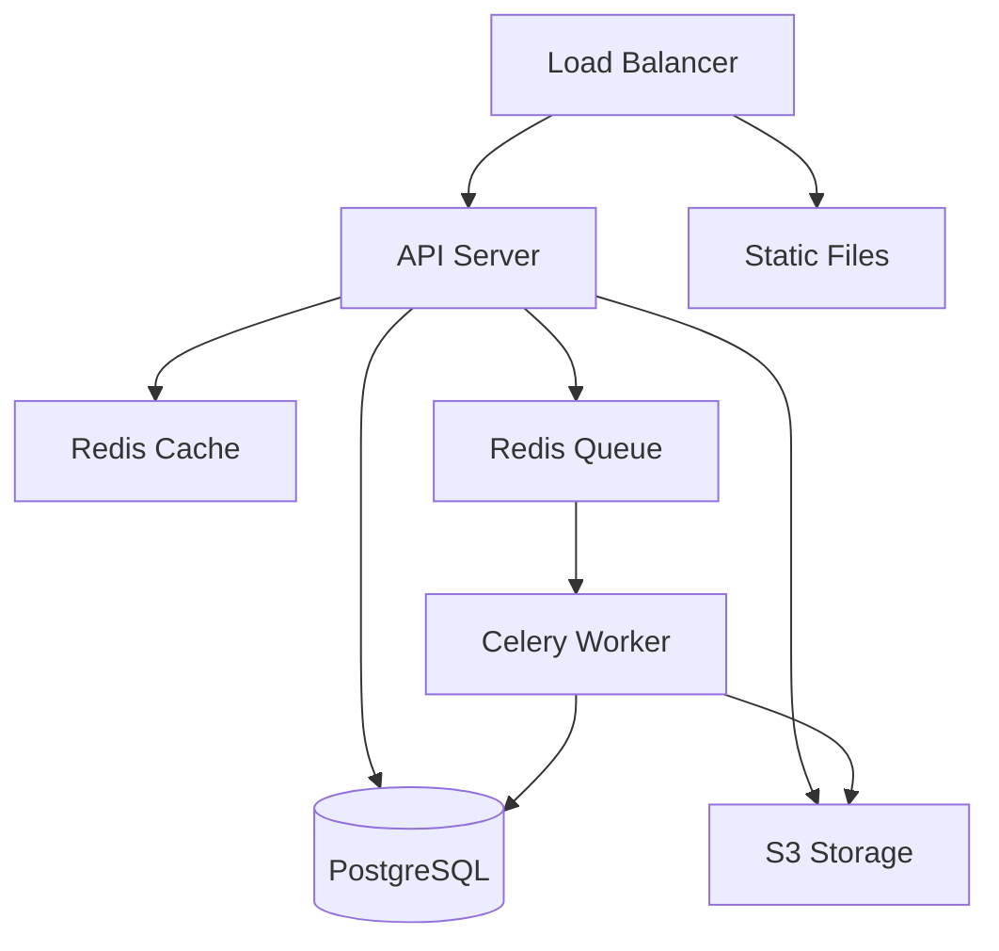

# Calibrify Architecture Overview

## System Architecture

Calibrify follows a modern, containerized microservices architecture designed for scalability and maintainability.



## Component Overview

### Backend Services

1. **Django Application Server**
   - REST API endpoints
   - Business logic
   - Authentication & authorization
   - Data validation
   - Task scheduling

2. **PostgreSQL Database**
   - Equipment records
   - Calibration history
   - User data
   - Audit logs

3. **Redis Services**
   - Session management
   - Caching layer
   - Task queue broker

4. **Celery Workers**
   - Async task processing
   - Email notifications
   - Report generation
   - File processing

### Frontend Architecture

1. **Static File Serving**
   - Nginx for production
   - Whitenoise for development
   - CDN integration support

2. **JavaScript Architecture**
   - Vanilla JS with modules
   - Event-driven design
   - Progressive enhancement

## Project Structure

```
calibrify-v2/
├── backend/
│   ├── apps/
│   │   ├── equipment/        # Equipment management
│   │   ├── calibration/      # Calibration tracking
│   │   ├── maintenance/      # Maintenance records
│   │   └── users/           # User management
│   ├── config/
│   │   ├── settings/        # Django settings
│   │   ├── urls.py         # URL routing
│   │   └── wsgi.py         # WSGI config
│   └── tests/              # Test suite
├── frontend/
│   ├── static/
│   │   ├── css/           # Stylesheets
│   │   ├── js/            # JavaScript modules
│   │   └── images/        # Static images
│   └── templates/         # HTML templates
└── docker/
    ├── development/       # Dev environment
    └── production/        # Prod environment
```

## Data Models

### Core Models

1. **Equipment**
   ```python
   class Equipment(models.Model):
       name = models.CharField()
       serial_number = models.CharField()
       category = models.ForeignKey(Category)
       location = models.ForeignKey(Location)
       status = models.CharField()
       # ...
   ```

2. **Calibration**
   ```python
   class Calibration(models.Model):
       equipment = models.ForeignKey(Equipment)
       date = models.DateTimeField()
       performed_by = models.ForeignKey(User)
       results = models.JSONField()
       # ...
   ```

3. **Maintenance**
   ```python
   class Maintenance(models.Model):
       equipment = models.ForeignKey(Equipment)
       type = models.CharField()
       scheduled_date = models.DateTimeField()
       completed_date = models.DateTimeField()
       # ...
   ```

## API Design

### RESTful Endpoints

1. **Equipment Management**
   ```
   GET    /api/v1/equipment/
   POST   /api/v1/equipment/
   GET    /api/v1/equipment/{id}/
   PUT    /api/v1/equipment/{id}/
   DELETE /api/v1/equipment/{id}/
   ```

2. **Calibration**
   ```
   GET    /api/v1/calibrations/
   POST   /api/v1/calibrations/
   GET    /api/v1/equipment/{id}/calibrations/
   ```

3. **Maintenance**
   ```
   GET    /api/v1/maintenance/
   POST   /api/v1/maintenance/
   GET    /api/v1/equipment/{id}/maintenance/
   ```

## Security Architecture

1. **Authentication**
   - JWT-based authentication
   - Session management
   - Password policies

2. **Authorization**
   - Role-based access control
   - Object-level permissions
   - API rate limiting

3. **Data Security**
   - Encryption at rest
   - TLS in transit
   - Regular security audits

## Scalability Considerations

1. **Horizontal Scaling**
   - Stateless API servers
   - Load balancer configuration
   - Session management

2. **Database Scaling**
   - Read replicas
   - Connection pooling
   - Query optimization

3. **Caching Strategy**
   - Multi-level caching
   - Cache invalidation
   - Cache warming

## Monitoring & Observability

1. **Metrics Collection**
   - Application metrics
   - System metrics
   - Business metrics

2. **Logging**
   - Structured logging
   - Log aggregation
   - Log retention

3. **Alerting**
   - Performance alerts
   - Error alerts
   - Business alerts

## Development Workflow

1. **Local Development**
   - Docker Compose setup
   - Hot reloading
   - Debug tooling

2. **Testing**
   - Unit tests
   - Integration tests
   - End-to-end tests

3. **Deployment**
   - CI/CD pipeline
   - Blue-green deployment
   - Rollback procedures

## Future Considerations

1. **Scalability**
   - Multi-tenant architecture
   - Geographic distribution
   - Load balancing

2. **Features**
   - Mobile app integration
   - Offline support
   - Real-time updates

3. **Integration**
   - Third-party APIs
   - Webhook support
   - Event streaming 